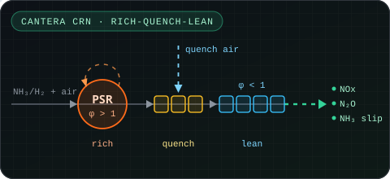

## 🔥 About Me

<table>
<tr>
<td width="50%" valign="top">

### 🧑‍🔬 The Researcher

- ⚙️ **Mechanical engineering** researcher working on **combustion and energy**
- 🌱 Focused on **carbon-free fuels**: the combustion of **ammonia (NH₃)** and **hydrogen (H₂)**
- 🔬 I bridge **physical experiments** and **computational modelling**: flames, chemical kinetics, CFD
- 🤖 …then hand the heavy lifting to **ML surrogates** and **multi-objective optimization**

</td>
<td width="50%" valign="top">

### 🚀 Current Quests

- 🎓 **Doctoral research:** integrating **AI/ML, CFD and experiments** toward the optimization design of combustors for **partially cracked ammonia**
- 🌀 **M.Sc. thesis:** design optimization of a **hydrogen micro gas turbine combustor**
- 🔥 **Partially cracked NH₃ flames:** stability, flame shape and NO emissions, in collaboration with the **University of Tokyo**
- ⚡ **NH₃-fired gas turbines:** reactor-network emission models and techno-economic optimization
- 🧠 Exploring **physics-informed ML** and reacting-flow CFD in **OpenFOAM**

</td>
</tr>
</table>

## 🧪 How I Work

## 🔬 Research Highlights

<table>
<tr>
<td width="50%" valign="top">

**Hydrogen micro gas turbine combustor** · *M.Sc. thesis* 
CFD design of experiments (Ansys Fluent, OpenFOAM) → Gaussian-process / Kriging surrogates → sensitivity analysis → multi-objective optimization of combustor geometry and operating conditions, for lower NOx and higher efficiency.

</td>
<td width="50%" valign="top">

**Partially cracked NH₃ flames** · *B.Sc. thesis, with UTokyo* 
Stability limits, flame shape and NO emissions of premixed NH₃/H₂/N₂ flames in co-flow and swirl burners: NH₂* chemiluminescence imaging with Abel inversion, backed by Cantera reactor networks.

</td>
</tr>
<tr>
<td width="50%" valign="top">

**[Counterflow flames of cracked ammonia](https://github.com/FlameEnjoyer/Cantera1D-Ammonia)** 
One-dimensional Cantera study of non-premixed counterflow flames: extinction and stability maps, NOx rate-of-production diagnostics, and ML-ready datasets from parametric sweeps.

</td>
<td width="50%" valign="top">

**NH₃-fired gas turbine systems** 
Chemical reactor networks of rich-quench-lean NH₃/H₂ combustors (NOx, N₂O, NH₃ slip), coupled with techno-economic modelling and surrogate-assisted NSGA-III optimization.

</td>
</tr>
</table>

## 🛠️ Tech Arsenal

**🔥 Combustion & CFD** 

**🧠 Machine Learning & Data** 

**🎯 Optimization** 

**⚙️ Energy & Process Simulation** 

**💻 Languages & Tools** 

## 📈 GitHub Analytics

  

<i>A blue premixed flame front propagating through my contribution graph, burning every commit it finds.</i>

<picture>
  <source media="(prefers-color-scheme: dark)" srcset="https://raw.githubusercontent.com/FlameEnjoyer/FlameEnjoyer/output/snake-dark.svg"/>
  <source media="(prefers-color-scheme: light)" srcset="https://raw.githubusercontent.com/FlameEnjoyer/FlameEnjoyer/output/snake-light.svg"/>
  
</picture>

  

🔥 Thanks for stopping by. May all your flames be lean, stable and low-NOx.

